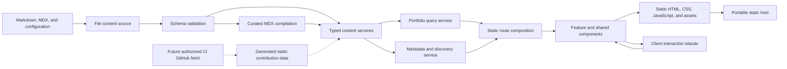

# Component Dependencies and Data Flow

## Dependency Direction

Dependencies flow inward from routes and presentation toward typed domain contracts, then outward through build-time adapters. Browser client islands remain isolated from file-system and secret-bearing code.

## Dependency Matrix

| Consumer | Route composition | Feature components | Shared UI | Query service | Content services | Validation and MDX | File source | Metadata service | Infrastructure adapters |
|---|---|---|---|---|---|---|---|---|---|
| Route composition | - | Uses | Uses | Uses | Detail routes only | No | No | Uses | No |
| Feature components | No | Composes locally | Uses | No | No | No | No | No | No |
| Shared UI | No | No | Composes locally | No | No | No | No | No | No |
| Client islands | No | Uses serializable models | Uses | No | No | No | No | No | No |
| Query service | No | No | No | - | Uses | No | No | May use | No |
| Content services | No | No | No | No | Compose locally | Uses | Uses | No | No |
| Validation and MDX | No | No | No | No | No | - | No | No | No |
| Metadata service | No | No | No | May consume route models | Uses published route data | No | No | - | No |
| Infrastructure adapters | No | No | No | No | Uses shared data contracts | Uses validation | May read generated files | No | - |

## Communication Patterns

### Static route composition

- Route modules call build-time services directly during static generation.
- Services return immutable serializable view models.
- Components render supplied models without runtime fetching.

### Detail route generation

- Route parameter generation requests published slugs from the relevant content service.
- The detail route requests the compiled record by slug.
- A missing or unpublished record resolves to the not-found path.

### Client interaction

- The project filter receives the complete published summary list and filters locally.
- Narrow navigation receives static items and owns only open or close state.
- The lightbox receives media metadata and owns selection and focus state.
- No client island imports server-only services.

### Metadata and discovery

- Metadata functions consume site configuration and validated route records.
- Sitemap generation combines only published slugs and fixed routes.
- Social images are local static assets.

### Future GitHub contribution data

- A separately authorized CI or build adapter may fetch authenticated data into a generated static file.
- A server-only data source validates and reads that file.
- The presentation boundary receives static calendar data or absence.
- V1 leaves this adapter inactive and renders no heatmap.

## Build-Time Data Flow

### Text alternative

1. Markdown, MDX, and configuration files enter through a constrained file-content source.
2. Schemas validate front matter and configuration.
3. Approved body content is compiled through the curated MDX component map.
4. Typed content services filter, sort, and expose records.
5. The portfolio query and metadata services produce route-ready models.
6. Static routes compose feature and shared components into HTML, CSS, minimal JavaScript, and assets.
7. Client islands enhance navigation, filtering, and gallery interactions without accessing server services.
8. The static artifact can be served by a portable host.
9. A future authorized CI fetch may write contribution data, but that flow is inactive in V1.

## Component Ownership Boundaries

| Boundary | Owns | Must not own |
|---|---|---|
| Routes | Route parameters, metadata hooks, composition | File parsing, validation rules, client state machines |
| Feature components | Domain presentation and composition | File access, secrets, deployment APIs |
| Shared UI | Reusable accessible presentation | Portfolio content rules |
| Client islands | Local interaction state | Content loading, static route generation, credentials |
| Query service | Route view-model orchestration | Rendering and browser state |
| Content services | Validation coordination, visibility, ordering, compilation | JSX composition and deployment behavior |
| Infrastructure adapters | CI inputs and host-specific preparation | Visitor rendering and core domain policy |

## Cycle Prevention

- Shared UI imports no feature modules.
- Feature modules may import shared UI but not sibling feature internals.
- Domain types may be shared; service implementations do not import route or presentation modules.
- Infrastructure adapters depend on stable domain contracts, never the reverse.
- Client modules cannot import modules marked server-only.

## Testing Seams

- Replace `FileContentSource` with an in-memory source for schema and loader tests.
- Test query services with stub content services.
- Test feature components with typed view-model fixtures.
- Test client islands independently using serializable props and keyboard events.
- Test metadata factories with fixed route records.
- Test the static build as the integrated dependency check.

## Diagram Validation

- Mermaid uses alphanumeric node identifiers and valid left-to-right connections.
- Labels are quoted and contain no unescaped quotes.
- The future integration uses dotted arrows to distinguish inactive V1 flow.
- The diagram has a complete text alternative.

## Extension Compliance

Optional extensions are disabled. Extension-specific dependency constraints are not applicable; no unresolved core dependency or security boundary remains.
