# Portfolio Execution Plan

## Planning Checklist

- [x] Load approved requirements, verification answers, personas, and stories.
- [x] Assess user-facing, structural, data, integration, testing, and delivery impact.
- [x] Select conditional AIDLC stages and adaptive depth.
- [x] Define a dependency-aware unit strategy for the greenfield application.
- [x] Create and validate the workflow visualization and text alternative.
- [x] Define success criteria and quality gates.
- [x] Obtain explicit user approval of this execution plan.

## Detailed Analysis Summary

### Project scope

- **Project type**: Greenfield static portfolio application
- **Primary change**: Create the complete application, content system, presentation layer, tests, automation configuration, and local build instructions.
- **Application boundary**: Next.js and TypeScript static export with Markdown or MDX content and no runtime database or application server.
- **External boundary**: Cloudflare Pages deployment, external account connections, production secrets, and canonical-hostname activation remain separately approved actions.

### Change impact assessment

- **User-facing changes**: Yes. A responsive multi-route portfolio and its complete visual language are new.
- **Structural changes**: Yes. The workspace requires the framework shell, route tree, component system, content loaders, configuration, scripts, and quality tooling.
- **Data model changes**: Yes. Typed schemas are required for projects, posts, reading records, documents, and site configuration.
- **API changes**: No visitor-facing application API is required. A future build-time GitHub GraphQL integration boundary is documented but its contribution heatmap is not enabled in V1.
- **NFR impact**: Significant. Static generation, accessibility, responsive behavior, performance, security, privacy, SEO, content validation, and zero-cost portability are acceptance concerns.
- **Infrastructure impact**: Configuration only during implementation. CI and static-host preparation are included; connecting and deploying to an external host are not.

### Risk assessment

- **Risk level**: Medium
- **Rollback complexity**: Easy before external deployment because changes remain local and static.
- **Testing complexity**: Complex because content states, generated routes, accessibility, responsive behavior, build output, and anti-slop constraints all require verification.
- **Primary risks**: Demonstration content being mistaken for genuine work, draft or private content leaking, static-route mismatch, accessibility regressions, media performance, and UI drift toward generic template patterns.
- **Controls**: Typed schemas, explicit `demo` and `draft` states, public-file guidance, test fixtures, static-build checks, accessibility review, centralized design tokens, and a dedicated anti-slop validation pass.

## Workflow Visualization

```mermaid
flowchart TD
    Start(["User request"])

    subgraph Inception["INCEPTION"]
        WD["Workspace Detection<br/>COMPLETED"]
        RE["Reverse Engineering<br/>SKIPPED"]
        RA["Requirements Analysis<br/>COMPLETED"]
        US["User Stories<br/>COMPLETED"]
        WP["Workflow Planning<br/>REVIEW"]
        AD["Application Design<br/>EXECUTE"]
        UG["Units Generation<br/>EXECUTE"]
    end

    subgraph Construction["CONSTRUCTION"]
        FD["Functional Design<br/>EXECUTE PER UNIT"]
        NR["NFR Requirements<br/>EXECUTE PER UNIT"]
        ND["NFR Design<br/>EXECUTE PER UNIT"]
        ID["Infrastructure Design<br/>EXECUTE FOR DELIVERY UNIT"]
        CG["Code Generation<br/>EXECUTE"]
        BT["Build and Test<br/>EXECUTE"]
    end

    subgraph Operations["OPERATIONS"]
        OPS["Operations<br/>PLACEHOLDER"]
    end

    Start --> WD
    WD --> RE
    RE --> RA
    RA --> US
    US --> WP
    WP --> AD
    AD --> UG
    UG --> FD
    FD --> NR
    NR --> ND
    ND --> ID
    ID --> CG
    CG --> BT
    BT --> OPS
    OPS --> End(["Workflow complete"])

    style WD fill:#4CAF50,stroke:#1B5E20,stroke-width:3px,color:#fff
    style RE fill:#BDBDBD,stroke:#424242,stroke-width:2px,stroke-dasharray:5 5,color:#000
    style RA fill:#4CAF50,stroke:#1B5E20,stroke-width:3px,color:#fff
    style US fill:#4CAF50,stroke:#1B5E20,stroke-width:3px,color:#fff
    style WP fill:#FFA726,stroke:#E65100,stroke-width:3px,stroke-dasharray:5 5,color:#000
    style AD fill:#FFA726,stroke:#E65100,stroke-width:3px,stroke-dasharray:5 5,color:#000
    style UG fill:#FFA726,stroke:#E65100,stroke-width:3px,stroke-dasharray:5 5,color:#000
    style FD fill:#FFA726,stroke:#E65100,stroke-width:3px,stroke-dasharray:5 5,color:#000
    style NR fill:#FFA726,stroke:#E65100,stroke-width:3px,stroke-dasharray:5 5,color:#000
    style ND fill:#FFA726,stroke:#E65100,stroke-width:3px,stroke-dasharray:5 5,color:#000
    style ID fill:#FFA726,stroke:#E65100,stroke-width:3px,stroke-dasharray:5 5,color:#000
    style CG fill:#4CAF50,stroke:#1B5E20,stroke-width:3px,color:#fff
    style BT fill:#4CAF50,stroke:#1B5E20,stroke-width:3px,color:#fff
    style OPS fill:#BDBDBD,stroke:#424242,stroke-width:2px,stroke-dasharray:5 5,color:#000
    style Start fill:#CE93D8,stroke:#6A1B9A,stroke-width:3px,color:#000
    style End fill:#CE93D8,stroke:#6A1B9A,stroke-width:3px,color:#000
    style Inception fill:#BBDEFB,stroke:#1565C0,stroke-width:3px,color:#000
    style Construction fill:#C8E6C9,stroke:#2E7D32,stroke-width:3px,color:#000
    style Operations fill:#FFF59D,stroke:#F57F17,stroke-width:3px,color:#000
    linkStyle default stroke:#333,stroke-width:2px
```

### Text alternative

1. Workspace Detection is complete.
2. Reverse Engineering was skipped because the workspace is greenfield.
3. Requirements Analysis and User Stories are complete.
4. Workflow Planning is awaiting approval.
5. Application Design and Units Generation will execute.
6. Each generated unit will receive the applicable Functional, NFR, and Infrastructure stages, followed by mandatory Code Generation.
7. Build and Test will execute after all units.
8. Operations remains a placeholder; external deployment needs separate approval.

## Stage Selection

### Inception phase

- [x] **Workspace Detection - Completed**
  - Confirmed a greenfield workspace and initialized state and audit artifacts.
- [x] **Reverse Engineering - Skipped**
  - No pre-existing application code or architecture requires analysis.
- [x] **Requirements Analysis - Completed**
  - Comprehensive requirements, clarification decisions, and traceability were approved.
- [x] **User Stories - Completed**
  - Two personas and fourteen feature-based stories were approved.
- [x] **Workflow Planning - Approved**
  - This document defines the proposed remaining workflow.
- [x] **Application Design - Completed at standard depth**
  - New layout, route, content, media, metadata, configuration, and quality components need explicit responsibilities and dependency boundaries.
- [x] **Units Generation - Completed at standard depth**
  - Multiple content schemas and user-facing domains warrant a structured, dependency-aware implementation breakdown.

### Construction phase

- [ ] **Functional Design - Execute where applicable per unit**
  - Content schemas, draft/demo visibility rules, sorting, filtering, static route generation, and empty states require detailed behavior.
- [ ] **NFR Requirements - Execute where applicable per unit**
  - Accessibility, static output, security, privacy, performance, SEO, and maintainability are explicit acceptance requirements.
- [ ] **NFR Design - Execute where NFR Requirements executes**
  - The implementation needs concrete design patterns for accessible interaction, validation, safe content rendering, media loading, and build quality.
- [ ] **Infrastructure Design - Execute for the delivery and automation unit**
  - CI checks, static-export constraints, future build-time GitHub data, Pages CMS configuration, and Cloudflare Pages preparation need mapping. No deployment will occur in this stage.
- [ ] **Code Generation - Execute for every unit**
  - Each unit requires an approved implementation plan, application code at the workspace root, tests, and supporting configuration.
- [ ] **Build and Test - Execute after all units**
  - The final system requires formatting, linting, type checking, targeted tests, accessibility checks, static build verification, and documented deployment preparation.

### Operations phase

- [ ] **Operations - Placeholder**
  - Production deployment and monitoring workflows are outside the current AIDLC implementation stages. Cloudflare publication remains a separately approved action.

## Proposed Unit Strategy

Units Generation will confirm or refine these boundaries.

### Unit 1: Content and Application Foundation

- Framework and static-export configuration
- Typed site configuration and content schemas
- Markdown or MDX loading, validation, ordering, demo flags, and draft filtering
- Shared metadata, error, and not-found foundations
- Dependency: none

### Unit 2: Portfolio Experience

- Editorial design tokens, typography, responsive shell, and navigation
- Home, projects, blog, reading, documents, and optional about experiences
- Three labelled demonstration projects and three labelled demonstration posts
- Accessible project media, filters, empty states, pending social labels, and working GitHub link
- Dependency: Unit 1 content contracts and loaders

### Unit 3: Quality, Authoring, and Delivery Preparation

- Pages CMS configuration and authoring guidance
- Test suites and automated anti-slop checks where practical
- CI quality workflow, static artifact verification, and future GitHub contribution boundary
- Cloudflare Pages build instructions without external publication
- Dependency: Units 1 and 2

## Per-Unit Stage Matrix

| Stage | Unit 1 | Unit 2 | Unit 3 |
|---|---|---|---|
| Functional Design | Execute | Execute | Skip; no new user-domain rules beyond prior units |
| NFR Requirements | Execute | Execute | Execute |
| NFR Design | Execute | Execute | Execute |
| Infrastructure Design | Skip; no external resources | Skip; static application UI only | Execute; CI and static-host preparation |
| Code Generation | Execute | Execute | Execute |

## Coordination and Sequence

- **Update approach**: Sequential units with integration checks after each unit.
- **Critical path**: Content schemas and loaders in Unit 1 must stabilize before route experiences consume them.
- **Coordination points**: Content type contracts, site configuration, design tokens, route metadata, test fixtures, and production static-export behavior.
- **Testing checkpoints**:
  1. Unit 1 validates schema behavior, draft and demo semantics, and static foundation.
  2. Unit 2 validates routes, content states, interaction, accessibility, and visual constraints.
  3. Unit 3 validates authoring, CI commands, artifact integrity, and delivery documentation.
  4. Build and Test validates the integrated application from a clean dependency installation.
- **Rollback strategy**: Keep each unit independently reviewable and avoid external deployment during construction.

## Effort Shape

- **Remaining inception stages**: Application Design and Units Generation
- **Construction units**: Three proposed units
- **Mandatory final stage**: Integrated Build and Test
- **Calendar estimate**: Not fixed because every AIDLC design and generation stage has an explicit user approval gate.

## Success Criteria

- The complete route set and static build work without a database or runtime server.
- Typed content behavior satisfies demo, draft, validation, sorting, filtering, and empty-state requirements.
- Three projects and three posts are substantial and visibly marked `Demo`.
- Reading, documents, contribution activity, and pending social destinations remain truthful and non-misleading.
- The interface is responsive, keyboard operable, reduced-motion aware, and consistent with the editorial engineering direction.
- All blocking anti-slop rules pass, with no invented owner claims or metrics.
- Formatting, linting, type checking, targeted tests, and the production static export succeed.
- Authoring and deployment preparation are documented without publishing externally.

## Quality Gates

- Approved Application Design and Units Generation artifacts
- Approved per-unit design and code-generation plans
- Content schema and visibility tests
- Representative component and route tests
- Automated and manual accessibility checks
- Anti-slop color, copy, icon, card, and section-targeting review
- Secret and public-document safety check
- Clean static production build

## Extension Compliance

- **Resiliency Baseline**: Disabled; not applicable.
- **Security Baseline**: Disabled; not applicable as an extension. Core security and privacy requirements remain planned in Units 1 and 3.
- **Property-Based Testing**: Disabled; not applicable as an extension. Focused automated tests remain planned in all units.

No enabled extension has an unresolved blocking finding.

## Content Validation Record

- The Mermaid diagram uses alphanumeric node identifiers and valid directed flowchart connections.
- Labels containing formatting are quoted, and no unescaped quote appears inside a label.
- Every visualized stage has a matching text alternative.
- Markdown tables, lists, links, and checkboxes were reviewed for parsing compatibility.
